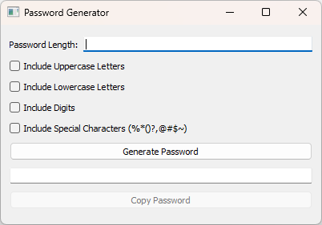

# Password Generator with PyQt5

This Python application generates passwords based on user-selected criteria using PyQt5 for the graphical user interface.

## Features

- Adjustable password length.
- Options to include uppercase letters, lowercase letters, digits, and special characters (%*()?,@#$~).
- Read-only field to display generated password for easy copying.

## Requirements

- Python 3.x
- PyQt5 library

## Installation

1. Clone the repository:

   ```bash
   git clone https://github.com/a-generation/password-generator-pyqt5.git
   cd password-generator-pyqt5
   ```

2. Install dependencies:

   ```bash
   pip install PyQt5
   ```

## Usage

1. Run the application:

   ```bash
   python password_generator.py
   ```

2. Set the desired password length using the input field.
3. Check the checkboxes to include uppercase letters, lowercase letters, digits, and special characters in the generated password.
4. Click the "Generate Password" button to generate a password based on your selections.
5. The generated password will appear in the read-only field.
6. Click the "Copy Password" button to copy the generated password to the clipboard.

## Example

```bash
python password.py
```



## License

This project is licensed under the MIT License. See the [LICENSE](LICENSE) file for details.

